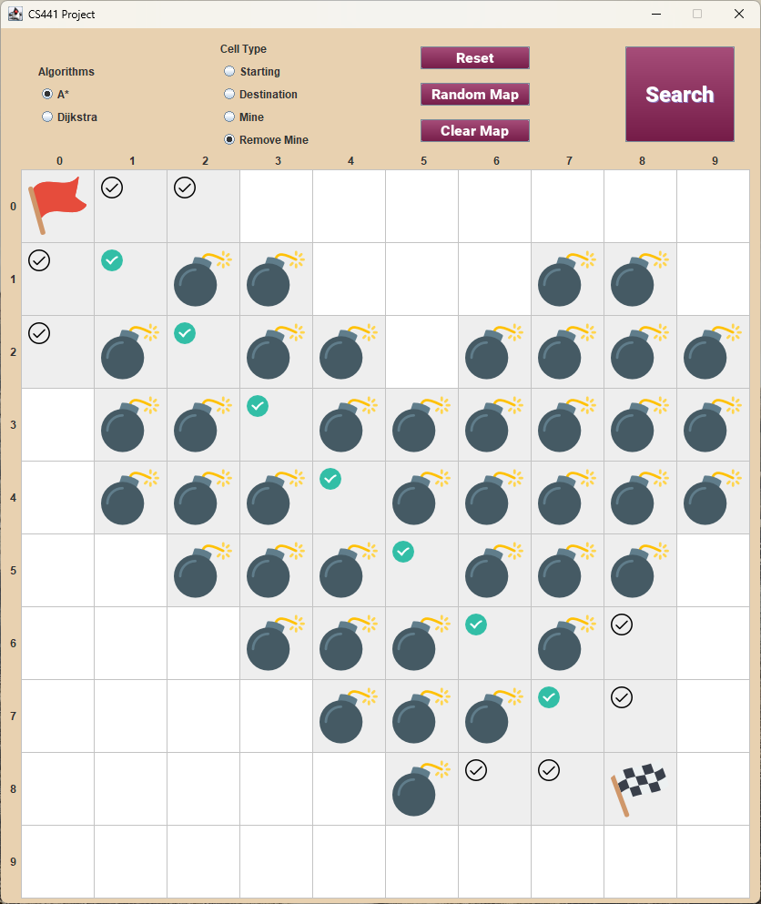

# AI Path Finder
 Implementation of A* and Dijkstra's algorithms on user-created map.

## A* Algorithm

A* search is a pathfinding algorithm that finds the shortest path between two points in a graph or grid. It combines Dijkstra's algorithm with a heuristic approach. It starts with an initial node and explores neighboring nodes based on their estimated cost to the goal. It updates the cost of each node if a better path is found. The algorithm terminates when the goal is reached or all nodes have been explored. A* search guarantees an optimal path if the heuristic is admissible and there are no negative weight cycles in the graph.

Minimizes:
$$f(n) = g(n) + h(n)$$ 
where $h(n)$ is the heuristic function and $g(n)$ is the cost of the path from start node.

The optimal cost then be shown as:

$$h(n) \leq h^*(n)$$

By using an appropriate heuristic, A* search can efficiently find the shortest path in various applications, including navigation systems, puzzle solving, and robot path planning.

## Dijkstra's Algorithm

Dijkstra's algorithm finds the shortest path between a starting node and all other nodes in a graph. It assigns tentative distances to nodes, explores neighbors, and updates distances based on the shortest paths found. It continues until all nodes are visited or the minimum tentative distance is infinity. Dijkstra's algorithm guarantees optimal paths for non-negative edge weights and can handle graphs with negative weights if there are no negative cycles. It is widely used in routing and pathfinding applications.

## Implementation

You can select the algorithm you want to use, create a map of your own and start exploring the path!

 

    

 

